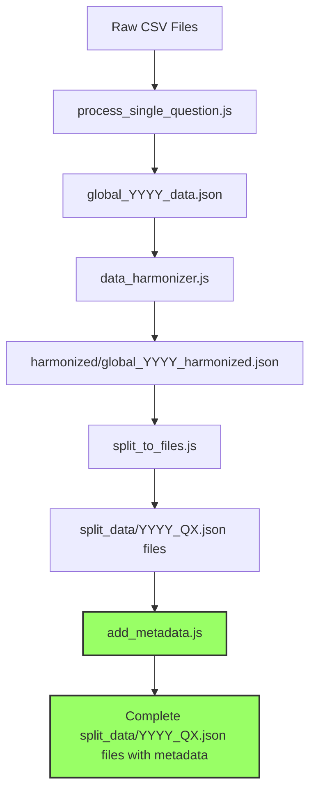

# Survey Data Processing Guide

This guide documents the complete workflow for processing survey data from raw CSV files to split question-specific JSON files that align with our canonical topic mapping.

## Overview of the Process



\*Now automated with add_metadata.js script

## Step 1: Process Raw CSV Files to Global JSON

The first step is to process the raw CSV files from the survey and combine them into a single global JSON file for each survey year.

### Input

- Individual question CSV files (e.g., `q1_global.csv`, `q2_global.csv`, etc.)

### Process

We use the `process_single_question.js` script to:

1. Read each CSV file
2. Extract question text and responses
3. Parse demographic data
4. Convert percentage values
5. Create a structured JSON object

### Command

```bash
# Process a single question file
node 2025_DATA/process_single_question.js 2025_DATA/q1_global.csv

# Process multiple files (example shell script)
for file in 2025_DATA/q*_global.csv; do
  node 2025_DATA/process_single_question.js "$file"
done
```

### Output

- `all_questions_mapped.csv` (intermediate file)
- `global_2024_data.json` and `global_2025_data.json`

## Step 2: Harmonize Data Structure

The second step is to harmonize the data structure between years to ensure consistency in formatting, categorization, and naming conventions.

### Input

- `global_2024_data.json` and `global_2025_data.json`

### Process

We use the `data_harmonizer.js` script to:

1. Standardize demographic category keys (region, age, gender, etc.)
2. Properly categorize demographic data that might be miscategorized
3. Convert percentage strings to decimal values for consistency
4. Ensure identical data structure between years
5. Handle misplaced data (e.g., region data in age category)
6. Standardize naming conventions
7. Align organization size brackets between years

### Command

```bash
# Run the harmonization script
node scripts/data_harmonizer.js
```

### Output

- `scripts/output/harmonized/global_2024_harmonized.json`
- `scripts/output/harmonized/global_2025_harmonized.json`

## Step 3: Split Data by Question

The next step is to split the harmonized data into individual question files based on the survey question definitions and canonical topic mapping.

### Input

- `scripts/output/harmonized/global_2024_harmonized.json`
- `scripts/output/harmonized/global_2025_harmonized.json`
- `scripts/reference files/survey_questions_2024.json`
- `scripts/reference files/survey_questions_2025.json`
- `scripts/reference files/canonical_topic_mapping.json`

### Process

We use the `split_to_files.js` script to:

1. Load survey question definitions to identify valid question IDs
2. Load canonical topic mapping to understand how questions map to topics
3. Extract and map responses to appropriate question IDs
4. Handle multipart statement questions by mapping responses to specific sub-questions
5. Create individual JSON files for each question ID
6. Ensure sub-questions are correctly mapped to their respective topics

### Command

```bash
# Run the split script
node scripts/split_to_files.js
```

### Output

- `scripts/output/split_data/2024_Q1.json`, `2024_Q2.json`, etc.
- `scripts/output/split_data/2025_Q1.json`, `2025_Q2.json`, etc.
- Sub-question files like `2025_7_1.json`, `2025_7_2.json`, etc.

## Step 4: Add Metadata to Question Files (Now Automated)

After splitting the data files, we now use the `add_metadata.js` script to automatically add structured metadata to each question file to enable proper querying, categorization, and display in the frontend.

### Input

- `scripts/output/split_data/YYYY_QX.json` files
- `scripts/reference files/canonical_topic_mapping.json`

### Process

We use the `add_metadata.js` script to:

1. Parse the file names to identify the year and question ID
2. Find the matching topic for each question using the canonical_topic_mapping.json file
3. Generate metadata for each file with the following fields:
   - **topicId**: The canonical topic (e.g., "Manager_Capability")
   - **questionId**: The question identifier (e.g., "Q9_1")
   - **year**: The survey year (e.g., 2025)
   - **keywords**: Generated from the `alternatePhrasings` in the canonical mapping
   - **canonicalQuestion**: The standardized question text from the topic mapping
   - **comparable**: Boolean indicating if year-over-year comparison is possible
   - **userMessage**: Guidance for data interpretation
   - **availableMarkets**: List of markets for which data is available (for comparable topics)
   - **relatedTopics**: Other topics related to this question
   - **dataStructure**: Standardized description of the JSON structure
4. Add the metadata to each question file
5. Handle special cases like:
   - Questions Q1, Q2, and Q3 that must always be non-comparable
   - Leadership_Confidence that must always be comparable with specific markets

### Keyword Generation

The script generates high-quality keywords for each file using the following approach:

1. First, it uses the `alternatePhrasings` from the canonical mapping file, which contain carefully crafted, topic-specific keyword phrases
2. It adds the topic ID as a keyword
3. For specific topics, it adds additional topic-specific keywords from a predefined list
4. If no alternatePhrasings are found in the canonical mapping, it falls back to programmatically generating keywords from the topic ID and canonical question

This approach ensures consistent, high-quality keywords across all files, which is crucial for search functionality and topic classification.

### Command

```bash
# Process all files
node scripts/add_metadata.js

# Process files for a specific year
node scripts/add_metadata.js --year=2024

# Force overwrite existing metadata
node scripts/add_metadata.js --force

# Verify canonical mapping without processing files
node scripts/add_metadata.js --verify-only
```

### Output

- Updated `scripts/output/split_data/YYYY_QX.json` files with complete metadata sections

### Example of Generated Metadata

```json
{
  "metadata": {
    "topicId": "AI_Readiness",
    "questionId": "Q5_4",
    "year": 2025,
    "keywords": [
      "AI readiness",
      "AI training",
      "effective use of AI",
      "AI adoption",
      "AI competence",
      "proficiency with AI",
      "AI tool training",
      "AI integration",
      "readiness for AI",
      "experimentation with AI"
    ],
    "canonicalQuestion": "How ready are you to adopt and use AI in your role?",
    "subQuestion": "I think using AI in my role will bolster my value in the next three years",
    "comparable": false,
    "userMessage": "Year‑on‑year comparisons not available due to new question additions in 2025.",
    "availableMarkets": [],
    "relatedTopics": [
      "Learning_and_Development",
      "Skills_Utilization",
      "AI_Attitudes"
    ],
    "dataStructure": {
      "questionField": "question",
      "responsesArray": "responses",
      "responseTextField": "response",
      "dataField": "data",
      "segments": [
        "region",
        "age",
        "gender",
        "org_size",
        "sector",
        "job_level",
        "relationship_status",
        "education",
        "generation",
        "employment_status"
      ],
      "primaryMetric": "country_overall",
      "valueFormat": "decimal",
      "sortOrder": "descending"
    }
  }
}
```

## The Importance of Canonical Topic Mapping

The canonical topic mapping plays a crucial role in our data processing workflow, particularly for handling multipart questions that need to be mapped to different topics in the taxonomy.

### Canonical Topic Mapping Structure

The `canonical_topic_mapping.json` file organizes survey questions into a coherent taxonomy with:

- **Themes**: High-level categories (e.g., "Talent Attraction & Retention")
- **Topics**: Specific focus areas within themes (e.g., "Attraction_Factors")
- **Question Mappings**: Connects specific question IDs from each survey year to topics

Example structure:

```json
{
  "themes": [
    {
      "name": "Leadership & Management",
      "topics": [
        {
          "id": "Leadership_Confidence",
          "canonicalQuestion": "How confident are you in your organization's leadership?",
          "mapping": {
            "2024": ["Q7", "Q18_6"],
            "2025": ["Q7_6", "Q8_1", "Q8_2", "Q9_2", "Q17_7"]
          }
        }
      ]
    }
  ]
}
```

### Handling Multipart Questions

Many statement-type questions (particularly in the 2025 survey) need to be split into subparts because:

1. **Different Topics**: Responses within a single question (e.g., Q7) may relate to different topics in our taxonomy
2. **Cross-Year Comparisons**: We need to map specific statements to enable accurate year-over-year comparisons
3. **Taxonomy Alignment**: The canonical mapping requires granular question parts for proper alignment

For example, Q7 in 2025 is split into multiple subquestions:

- Q7_1: Organization handling of decisions (maps to the "Leadership_Confidence" topic)
- Q7_2: Job market concerns (maps to the "Intention_to_Leave" topic)
- Q7_3: People over profits (maps to "Culture_and_Values" topic)

### How Splitting Works

In `split_to_files.js`, we:

1. Load the canonical mapping to understand the required subquestion structure
2. Analyze response content to determine the appropriate subquestion category
3. Use keyword matching to identify which topic each statement belongs to
4. Create separate files for each subquestion, rather than combining all statements into one file

This ensures that when data is later queried by topic, we can retrieve the correct statements from each survey year that relate to that specific topic.

## Sub-Question Mapping

The `split_to_files.js` script handles the complex task of mapping statement-type questions to their appropriate sub-questions based on the canonical topic mapping. For example:

- Statement responses for Q7 (Economic Security and Organizational Values) are mapped to specific sub-questions:
  - "organization handles decisions" → 7_1
  - "job market" → 7_2
  - "people over profits" → 7_3
  - etc.

This is crucial for proper topic mapping as defined in the canonical_topic_mapping.json file.

## Future Improvements

1. **Process_single_question.js Update**: The `process_single_question.js` script needs to be updated to include the harmonization step directly, integrating the functionality of `data_harmonizer.js`.

2. **Related Topics Generation Enhancement**: Improve the algorithm for generating related topics by using more sophisticated content analysis and similarity metrics.

3. **Automated Workflow**: Create a single command or script that runs the entire process from CSV to complete metadata-enriched split files.

4. **Validation**: Add validation steps to verify the integrity of the data and metadata at each stage of processing.

5. **Canonical Mapping Maintenance**: Create tools to help maintain and update the canonical mapping when new questions are added or classifications change.

6. **Keyword Expansion**: Develop more advanced keyword generation algorithms that can extract relevant terms from response data.

### Implementation of add_metadata.js

The implementation of `add_metadata.js` includes several key features:

- **Topic Matching Logic**: Uses multiple approaches to match questions to topics

  - Exact file name matching
  - Question ID format variations (with/without "Q" prefix, with/without underscore)
  - Pattern matching on file names
  - Parent question matching for sub-questions

- **Keyword Generation**: Prioritizes keywords from the canonical mapping's alternatePhrasings

  ```javascript
  // Simplified version of the keyword generation logic
  function generateKeywords(topic) {
    // Use alternatePhrasings from canonical mapping as primary source
    if (topic.alternatePhrasings && topic.alternatePhrasings.length > 0) {
      let keywords = [...topic.alternatePhrasings];
      // Add topic ID if not included
      if (!keywords.includes(topic.id)) {
        keywords.push(topic.id);
      }
      // Add topic-specific keywords from predefined list if available
      // ...
      return keywords;
    }

    // Fall back to programmatic generation if no alternatePhrasings
    // ...
  }
  ```

- **Related Topics Generation**: Finds related topics based on:

  - Topics from the same theme
  - Keyword matching between topics
  - Predefined common topic pairings

- **Comparable Topics Handling**: Verifies and handles comparable topics correctly
  - Ensures Q1, Q2, and Q3 are always non-comparable
  - Special handling for Leadership_Confidence which must be comparable
  - Adds appropriate availableMarkets and userMessage based on comparable status

This script now fully automates what was previously a manual process, ensuring consistency across all files and eliminating human error in metadata generation.

## Troubleshooting

### Missing Question Files

If certain question files are missing after the split process, check:

- The question ID mapping in the split_to_files.js script
- The statement response patterns used for matching
- The canonical mapping file for any inconsistencies

### Incorrect Demographic Data

If demographic data appears incorrect, adjust the categorization mappings in `data_harmonizer.js`.

### Missing or Incorrect Metadata

If files are missing metadata or have incorrect topic mapping:

- Check that the question ID is properly included in the canonical_topic_mapping.json
- Verify that the question text matches the expected pattern for the topic
- Run the metadata generation script (once developed) with verbose logging

## Data Structure Reference

### Raw CSV Structure

The raw CSV files have column headers like:

- Question, Response, Total, Overall, country_US, etc.

### Global JSON Structure

```json
[
  {
    "question": "What factors would make you leave your current company?",
    "response": "Poor work/life balance",
    "data": {
      "region": { "united_states": 0.75, ... },
      "age": { "18-24": 0.82, ... },
      ...
    }
  }
]
```

### Complete Split Question File Structure (with Metadata)

```json
{
  "metadata": {
    "topicId": "Culture_and_Values",
    "questionId": "Q9_4",
    "year": 2025,
    "keywords": [
      "company culture",
      "external reputation",
      "brand consistency",
      "organizational identity",
      "internal experience"
    ],
    "canonicalQuestion": "How important are company culture and values to your work experience?",
    "comparable": true,
    "userMessage": "Data based on comparable markets only.",
    "availableMarkets": [
      "United Kingdom",
      "United States",
      "Australia",
      "India",
      "Brazil"
    ],
    "relatedTopics": [
      "Organizational_Adaptation",
      "Leadership_Confidence"
    ],
    "dataStructure": {
      "questionField": "question",
      "responsesArray": "responses",
      "responseTextField": "response",
      "dataField": "data",
      "segments": [
        "region",
        "age",
        "gender",
        "org_size",
        "sector",
        "job_level",
        "relationship_status",
        "education",
        "generation",
        "employment_status"
      ],
      "primaryMetric": "country_overall",
      "valueFormat": "decimal",
      "sortOrder": "desc"
    }
  },
  "question": "To what extent do you agree with the following statements.",
  "responses": [
    {
      "response": "Our external reputation matches our internal culture",
      "data": {
        "region": { ... },
        "age": { ... },
        ...
      }
    }
  ]
}
```
