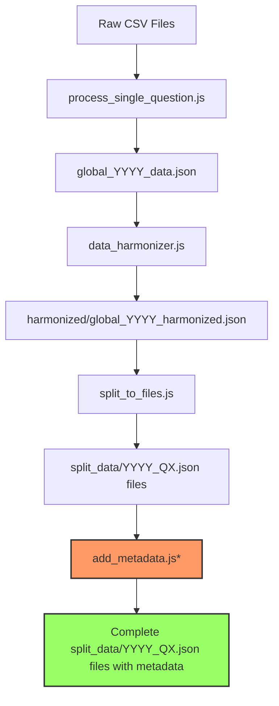

# Survey Data Processing Guide

This guide documents the complete workflow for processing survey data from raw CSV files to split question-specific JSON files that align with our canonical topic mapping.

## Overview of the Process



\*Currently done manually, needs to be automated in the future

## Step 1: Process Raw CSV Files to Global JSON

The first step is to process the raw CSV files from the survey and combine them into a single global JSON file for each survey year.

### Input

- Individual question CSV files (e.g., `q1_global.csv`, `q2_global.csv`, etc.)

### Process

We use the `process_single_question.js` script to:

1. Read each CSV file
2. Extract question text and responses
3. Parse demographic data
4. Convert percentage values
5. Create a structured JSON object

### Command

```bash
# Process a single question file
node 2025_DATA/process_single_question.js 2025_DATA/q1_global.csv

# Process multiple files (example shell script)
for file in 2025_DATA/q*_global.csv; do
  node 2025_DATA/process_single_question.js "$file"
done
```

### Output

- `all_questions_mapped.csv` (intermediate file)
- `global_2024_data.json` and `global_2025_data.json`

## Step 2: Harmonize Data Structure

The second step is to harmonize the data structure between years to ensure consistency in formatting, categorization, and naming conventions.

### Input

- `global_2024_data.json` and `global_2025_data.json`

### Process

We use the `data_harmonizer.js` script to:

1. Standardize demographic category keys (region, age, gender, etc.)
2. Properly categorize demographic data that might be miscategorized
3. Convert percentage strings to decimal values for consistency
4. Ensure identical data structure between years
5. Handle misplaced data (e.g., region data in age category)
6. Standardize naming conventions
7. Align organization size brackets between years

### Command

```bash
# Run the harmonization script
node scripts/data_harmonizer.js
```

### Output

- `scripts/output/harmonized/global_2024_harmonized.json`
- `scripts/output/harmonized/global_2025_harmonized.json`

## Step 3: Split Data by Question

The next step is to split the harmonized data into individual question files based on the survey question definitions and canonical topic mapping.

### Input

- `scripts/output/harmonized/global_2024_harmonized.json`
- `scripts/output/harmonized/global_2025_harmonized.json`
- `scripts/reference files/survey_questions_2024.json`
- `scripts/reference files/survey_questions_2025.json`
- `scripts/reference files/canonical_topic_mapping.json`

### Process

We use the `split_to_files.js` script to:

1. Load survey question definitions to identify valid question IDs
2. Load canonical topic mapping to understand how questions map to topics
3. Extract and map responses to appropriate question IDs
4. Handle multipart statement questions by mapping responses to specific sub-questions
5. Create individual JSON files for each question ID
6. Ensure sub-questions are correctly mapped to their respective topics

### Command

```bash
# Run the split script
node scripts/split_to_files.js
```

### Output

- `scripts/output/split_data/2024_Q1.json`, `2024_Q2.json`, etc.
- `scripts/output/split_data/2025_Q1.json`, `2025_Q2.json`, etc.
- Sub-question files like `2025_7_1.json`, `2025_7_2.json`, etc.

## Step 4: Add Metadata to Question Files (Currently Manual)

After splitting the data files, we need to add structured metadata to each question file to enable proper querying, categorization, and display in the frontend.

### Input

- `scripts/output/split_data/YYYY_QX.json` files
- `scripts/reference files/canonical_topic_mapping.json`

### Process

Currently, this process is done **manually** for each file:

1. Identify the topic for each question using the canonical_topic_mapping.json file
2. Create a metadata section with standardized fields:

   - topicId: The canonical topic (e.g., "Manager_Capability")
   - questionId: The question identifier (e.g., "Q9_1")
   - year: The survey year (e.g., 2025)
   - keywords: Relevant keywords for search/classification
   - canonicalQuestion: The standardized question text from the topic mapping
   - comparable: Boolean indicating if year-over-year comparison is possible
   - userMessage: Guidance for data interpretation
   - availableMarkets: List of markets for which data is available
   - relatedTopics: Other topics related to this question
   - dataStructure: Standardized description of the JSON structure

3. Add this metadata to the top of each question file

### Example of Metadata Structure

```json
{
  "metadata": {
    "topicId": "Manager_Capability",
    "questionId": "Q9_1",
    "year": 2025,
    "keywords": [
      "manager effectiveness",
      "employee empowerment",
      "supervisor support",
      "leadership quality",
      "management style",
      "direct manager relationships"
    ],
    "canonicalQuestion": "How effective is your direct manager?",
    "comparable": false,
    "userMessage": "New in 2025; no year‑on‑year comparison.",
    "availableMarkets": [],
    "relatedTopics": ["Leadership_Confidence", "Employee_Wellbeing"],
    "dataStructure": {
      "questionField": "question",
      "responsesArray": "responses",
      "responseTextField": "response",
      "dataField": "data",
      "segments": [
        "region",
        "age",
        "gender",
        "org_size",
        "sector",
        "job_level",
        "relationship_status",
        "education",
        "generation",
        "employment_status"
      ],
      "primaryMetric": "country_overall",
      "valueFormat": "decimal",
      "sortOrder": "desc"
    }
  },
  "question": "To what extent do you agree with the following statements.",
  "responses": [
    // response data...
  ]
}
```

### Future Automation Need

**This manual process needs to be automated.** A new script (e.g., `add_metadata.js`) should be developed to:

1. Read the canonical_topic_mapping.json to identify topics for each question
2. Generate appropriate metadata for each question file based on its ID and topic
3. Update the split JSON files with this metadata
4. Add consistency checks to ensure metadata aligns with file content

## The Importance of Canonical Topic Mapping

The canonical topic mapping plays a crucial role in our data processing workflow, particularly for handling multipart questions that need to be mapped to different topics in the taxonomy.

### Canonical Topic Mapping Structure

The `canonical_topic_mapping.json` file organizes survey questions into a coherent taxonomy with:

- **Themes**: High-level categories (e.g., "Talent Attraction & Retention")
- **Topics**: Specific focus areas within themes (e.g., "Attraction_Factors")
- **Question Mappings**: Connects specific question IDs from each survey year to topics

Example structure:

```json
{
  "themes": [
    {
      "name": "Leadership & Management",
      "topics": [
        {
          "id": "Leadership_Confidence",
          "canonicalQuestion": "How confident are you in your organization's leadership?",
          "mapping": {
            "2024": ["Q7", "Q18_6"],
            "2025": ["Q7_6", "Q8_1", "Q8_2", "Q9_2", "Q17_7"]
          }
        }
      ]
    }
  ]
}
```

### Handling Multipart Questions

Many statement-type questions (particularly in the 2025 survey) need to be split into subparts because:

1. **Different Topics**: Responses within a single question (e.g., Q7) may relate to different topics in our taxonomy
2. **Cross-Year Comparisons**: We need to map specific statements to enable accurate year-over-year comparisons
3. **Taxonomy Alignment**: The canonical mapping requires granular question parts for proper alignment

For example, Q7 in 2025 is split into multiple subquestions:

- Q7_1: Organization handling of decisions (maps to the "Leadership_Confidence" topic)
- Q7_2: Job market concerns (maps to the "Intention_to_Leave" topic)
- Q7_3: People over profits (maps to "Culture_and_Values" topic)

### How Splitting Works

In `split_to_files.js`, we:

1. Load the canonical mapping to understand the required subquestion structure
2. Analyze response content to determine the appropriate subquestion category
3. Use keyword matching to identify which topic each statement belongs to
4. Create separate files for each subquestion, rather than combining all statements into one file

This ensures that when data is later queried by topic, we can retrieve the correct statements from each survey year that relate to that specific topic.

## Sub-Question Mapping

The `split_to_files.js` script handles the complex task of mapping statement-type questions to their appropriate sub-questions based on the canonical topic mapping. For example:

- Statement responses for Q7 (Economic Security and Organizational Values) are mapped to specific sub-questions:
  - "organization handles decisions" → 7_1
  - "job market" → 7_2
  - "people over profits" → 7_3
  - etc.

This is crucial for proper topic mapping as defined in the canonical_topic_mapping.json file.

## Future Improvements

1. **Process_single_question.js Update**: The `process_single_question.js` script needs to be updated to include the harmonization step directly, integrating the functionality of `data_harmonizer.js`.

2. **Metadata Automation**: Develop a new script or extend `split_to_files.js` to automatically add metadata to each output file based on the canonical_topic_mapping.json. This should:

   - Extract topic information for each question ID
   - Generate appropriate keywords based on topic and question content
   - Add standardized metadata structure to each file
   - Ensure consistency between metadata and file content

3. **Automated Workflow**: Create a single command or script that runs the entire process from CSV to complete metadata-enriched split files.

4. **Validation**: Add validation steps to verify the integrity of the data and metadata at each stage of processing.

5. **Canonical Mapping Maintenance**: Create tools to help maintain and update the canonical mapping when new questions are added or classifications change.

### Proposed Metadata Generation Script

A basic outline for the metadata automation script:

```javascript
// metadata_generator.js
const fs = require("fs");
const path = require("path");

// Load canonical topic mapping
const canonicalMapping = JSON.parse(
  fs.readFileSync(
    "./scripts/reference files/canonical_topic_mapping.json",
    "utf8"
  )
);

// Get all split data files
const dataDir = "./scripts/output/split_data/";
const files = fs
  .readdirSync(dataDir)
  .filter((file) => file.match(/^\d{4}_\d+(_\d+)?\.json$/));

// Process each file
files.forEach((file) => {
  // Parse file name to get year and question ID
  const [year, questionId] = parseFileName(file);

  // Find topic for this question in canonical mapping
  const topic = findTopicForQuestion(canonicalMapping, year, questionId);

  if (!topic) {
    console.warn(`No topic found for ${file}`);
    return;
  }

  // Read the file
  const filePath = path.join(dataDir, file);
  const fileData = JSON.parse(fs.readFileSync(filePath, "utf8"));

  // Generate metadata structure
  const metadata = generateMetadata(topic, year, questionId, fileData);

  // Add metadata to file data
  const updatedData = {
    metadata,
    ...fileData,
  };

  // Write back to file
  fs.writeFileSync(filePath, JSON.stringify(updatedData, null, 2));

  console.log(`Added metadata to ${file}`);
});

// Helper functions would be implemented here...
```

## Integrating Harmonization into process_single_question.js

Currently, our data processing involves three separate steps. A planned enhancement is to integrate the harmonization step directly into `process_single_question.js`. Here's the approach for this integration:

### Current Limitations

The current `process_single_question.js` script has several limitations:

1. It outputs data that may have inconsistent demographic categories
2. It doesn't standardize keys between years
3. It doesn't handle misplaced demographic data
4. It requires a separate harmonization step

### Planned Updates

The updated script will incorporate the following enhancements:

1. **Direct Category Mapping**: Implement the categorization mappings from `data_harmonizer.js` directly in the processing stage:

   ```javascript
   // Example of how this will work
   function processDemographicData(rawData) {
     const mappedData = {
       region: {},
       age: {},
       gender: {},
       // ...other categories
     };

     // Apply mapping directly to each field
     for (const [key, value] of Object.entries(rawData)) {
       const mapping = getCategoryMapping(key);
       if (mapping) {
         mappedData[mapping.category][mapping.standardKey] =
           convertPercentToDecimal(value);
       }
     }

     return mappedData;
   }
   ```

2. **Standardized Output Structure**: Ensure the JSON output follows the harmonized format directly:

   ```javascript
   // Sample of the output format
   const outputFormat = {
     question: "Question text",
     response: "Response text",
     data: {
       region: { "united_states": 0.75, ... },
       age: { "18-24": 0.82, ... },
       // All standardized categories
     }
   };
   ```

3. **Modular Design**: The new script will use a modular approach:

   - Separate modules for parsing, mapping, and output generation
   - Reusable harmonization functions
   - Configuration-based category mappings

4. **Command-Line Options**:
   ```bash
   # Planned command-line interface
   node process_single_question.js --input=file.csv --output=output.json --year=2025 --harmonize=true
   ```

### Implementation Timeline

1. **Phase 1**: Extract reusable functions from `data_harmonizer.js`
2. **Phase 2**: Create a shared library for category mappings
3. **Phase 3**: Update `process_single_question.js` to use the shared functions
4. **Phase 4**: Add command-line options for harmonization
5. **Phase 5**: Deprecate separate harmonization step

This integration will streamline the workflow by reducing the number of steps required to process survey data while ensuring consistent output format.

## Troubleshooting

### Missing Question Files

If certain question files are missing after the split process, check:

- The question ID mapping in the split_to_files.js script
- The statement response patterns used for matching
- The canonical mapping file for any inconsistencies

### Incorrect Demographic Data

If demographic data appears incorrect, adjust the categorization mappings in `data_harmonizer.js`.

### Missing or Incorrect Metadata

If files are missing metadata or have incorrect topic mapping:

- Check that the question ID is properly included in the canonical_topic_mapping.json
- Verify that the question text matches the expected pattern for the topic
- Run the metadata generation script (once developed) with verbose logging

## Data Structure Reference

### Raw CSV Structure

The raw CSV files have column headers like:

- Question, Response, Total, Overall, country_US, etc.

### Global JSON Structure

```json
[
  {
    "question": "What factors would make you leave your current company?",
    "response": "Poor work/life balance",
    "data": {
      "region": { "united_states": 0.75, ... },
      "age": { "18-24": 0.82, ... },
      ...
    }
  }
]
```

### Complete Split Question File Structure (with Metadata)

```json
{
  "metadata": {
    "topicId": "Culture_and_Values",
    "questionId": "Q9_4",
    "year": 2025,
    "keywords": [
      "company culture",
      "external reputation",
      "brand consistency",
      "organizational identity",
      "internal experience"
    ],
    "canonicalQuestion": "How important are company culture and values to your work experience?",
    "comparable": true,
    "userMessage": "Data based on comparable markets only.",
    "availableMarkets": [
      "United Kingdom",
      "United States",
      "Australia",
      "India",
      "Brazil"
    ],
    "relatedTopics": [
      "Organizational_Adaptation",
      "Leadership_Confidence"
    ],
    "dataStructure": {
      "questionField": "question",
      "responsesArray": "responses",
      "responseTextField": "response",
      "dataField": "data",
      "segments": [
        "region",
        "age",
        "gender",
        "org_size",
        "sector",
        "job_level",
        "relationship_status",
        "education",
        "generation",
        "employment_status"
      ],
      "primaryMetric": "country_overall",
      "valueFormat": "decimal",
      "sortOrder": "desc"
    }
  },
  "question": "To what extent do you agree with the following statements.",
  "responses": [
    {
      "response": "Our external reputation matches our internal culture",
      "data": {
        "region": { ... },
        "age": { ... },
        ...
      }
    }
  ]
}
```
